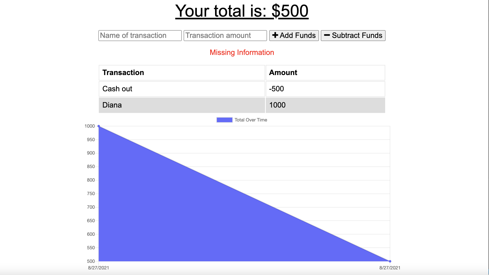
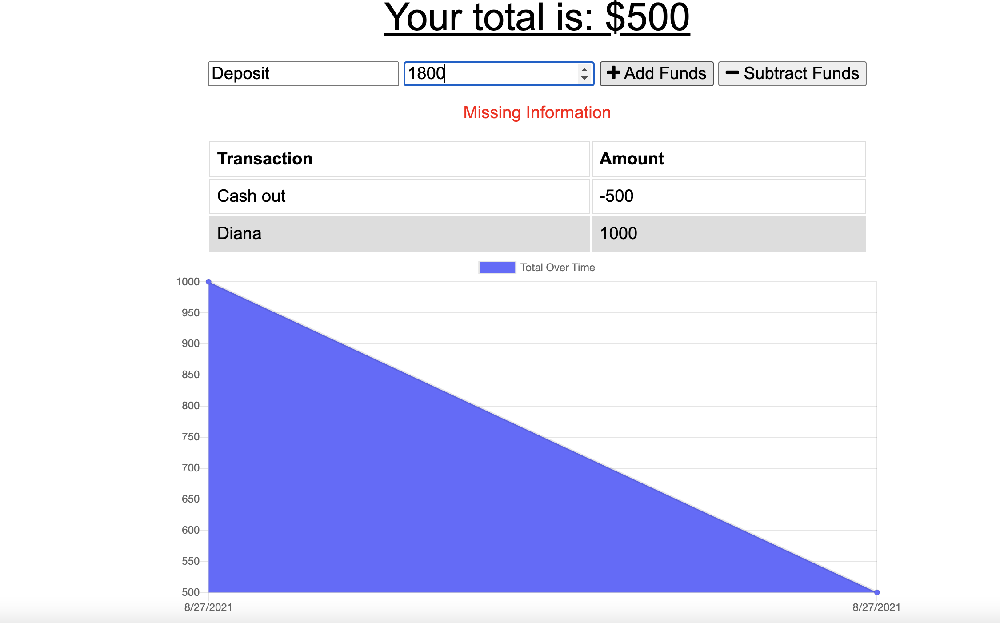
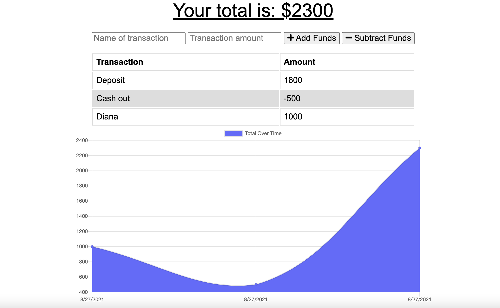

# Offline-Budget

## Description
Tasked with adding functionality to an existing Budget Tracker application, allowing for offline access and functionality.

The user is now able to add expenses and deposits to their budget with or without a connection. When entering transactions offline, they will populate the total when brought back online.

Great application for keeping track of a budget when traveling. Allows for transaction additions offline in case of inactive WiFi. 

Offline Functionality:

  * Enter deposits offline

  * Enter expenses offline

When brought back online:

  * Offline entries will then be added to the tracker.

## Table of Contents
  * [Installation](#installation)
  * [Usage](#usage)
  * [License](#license)

## Deployed Application
* [Budget Tracker](https://salty-woodland-01459.herokuapp.com)

## Installation

The app is deployed and setup using Heroku.

## Usage
- User is on Budget App without an internet connection.
- Allows user input of a withdrawal or deposit.
- Calculates the budget based on the added or subtracted transaction amounts.
- If the user is offline, the data will be added to their transaction history when their connection is back online.

## Screenshots

## Credits

This app uses the following libraries and modules: 

* Express
* Mongoose
* Express.Router
* Compass for viewing the database
* IndexedDB (offline storage)

## License
Copyright 2021 Diana L. Daghlas
